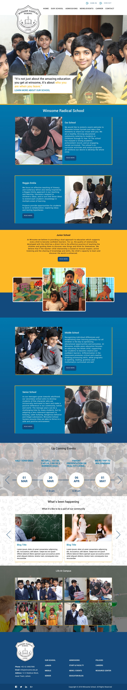

# Winsome-School
App is in progress using ReactJS, Redux, Webpack, Sass. It aims at helping to empower faculty and staff to contribute to the website, delegating the publishing responsibilities, so they can keep their content up to date. It will be powerful enough for web admins to be efficient, simple enough for any user – regardless of their tech skills – to use it confidently.  The simplicity of this Web App enables any school – regardless of the range of staff’s technical abilities – to shift how content is managed on school website. 

# Installation.
To install dependencies just do

<h4>After cloning,<h/4>

$ cd Winsome-School

$ npm install

<h4>Start local development server (available at https://localhost:8080/):</h4>

$ npm run dev

<h2>Preview of App</h2>

